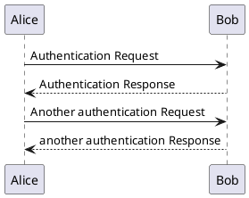
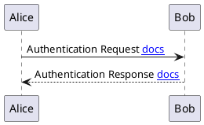

# docsify-plantuml
[](https://www.npmjs.com/package/docsify-plantuml)

## Install
1. Configure docsify-plantuml (optional):

    ```html
    <script>
    window.$docsify = {
      plantuml: {
        skin: 'default',
      },
    }
    </script>
    ```
    
    See [Options](#Options) for more details.

2. Insert script into docsify document:

    ```html
    <script src="//unpkg.com/docsify-plantuml/dist/docsify-plantuml.min.js"></script>
    ```


## Usage
Write your plantuml code into a code block marked ``plantuml``:

````markdown
### Section X

````


## Options
## skin
By default, we set the skin of the plantuml to [a cleaner version](https://github.com/matthewjosephtaylor/plantuml-style) for you.
However, You can still switch with this option (`skin`) if you prefer the classic one.

All available values are:
- `default`
- `classic`

For example:
```
<script>
window.$docsify = {
  plantuml: {
    skin: 'classic',
  },
}
</script>
```

## serverPath
By default, the official PlantUML server is used. If you have your own, configure it using the `serverPath` option:

```
<script>
window.$docsify = {
  plantuml: {
    serverPath: 'https://custom-server.local/plantuml/png/',
  },
}
</script>
```

## renderSvgAsObject
By default, the svg is renderd inside an `` tag. 
If you want interactive svg (like links) configure the `renderSvgAsObject` option:
This will render like: `<object type='image/svg+xml' data=''/>`

```
<script>
window.$docsify = {
  plantuml: {
    renderSvgAsObject: true,
  },
}
</script>
```
Please note that relative urls should start with `$`
````markdown

````

## Example
### Basic Usage
- [index.html](example/basic/index.html)
- [README.md](https://raw.githubusercontent.com/imyelo/docsify-plantuml/master/example/basic/README.md)

### Render as SVG Object
- [index.html](example/svg-object/index.html)


## Related
- [docsify](https://github.com/QingWei-Li/docsify/)
- [PlantUML](http://plantuml.com/)


## License
MIT &copy; yelo, 2017 - present
