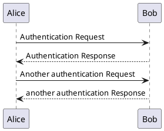

# docsify-plantuml
[](https://www.npmjs.com/package/docsify-plantuml)

## Install
1. insert script into docsify document
```
<script src="//unpkg.com/docsify-plantuml/dist/docsify-plantuml.min.js"></script>
```

## Usage
Write your plantuml code into a code block marked ``plantuml``:

````markdown
### Section X

````


## Example
- [index.html](example/index.html)
- [README.md](https://raw.githubusercontent.com/imyelo/docsify-plantuml/master/example/README.md)


## Related
- [docsify](https://github.com/QingWei-Li/docsify/)
- [PlantUML](http://plantuml.com/)


## License
the MIT License
