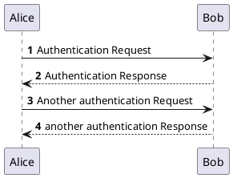

# Example

# Basic 1
```plantuml
:一级: -right-*  :二级: 
```

## Basic 2

```plantuml
@startuml
autonumber

Alice -> Bob: Authentication Request
Bob --> Alice: Authentication Response

Alice -> Bob: Another authentication Request
Alice <-- Bob: another authentication Response
@enduml
```
